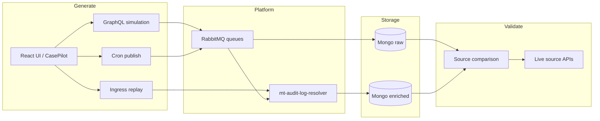

# NextGen Audit Automation — Project Overview

High-level map of this repository: what each area does, how data moves through the system, and where to look when extending coverage.

For API details and enrichment rules see [TECHNICAL.md](./TECHNICAL.md). For CasePilot UI generation see [CASEPILOT_INTEGRATION.md](./CASEPILOT_INTEGRATION.md).

---

## What this repo does

End-to-end **audit event QA** for Monotype NextGen:

1. **Generate** audit events (GraphQL simulation, Ingress replay, Cron publish, or UI via CasePilot / Playwright).
2. **Land** raw + enriched payloads in MongoDB (via built-in RabbitMQ ingestion or platform services).
3. **Compare** enriched fields against live source APIs (UMS, CMS, AMS, Discovery, …) and show PASS / FAIL / SKIP in the UI.
4. **Map** operations to TestRail cases (FDC-14091 suite) for traceability and UI automation.

---

## End-to-end flow



**Typical GraphQL path**

1. User selects operations on **Generate** → backend runs `audit_validator` simulation (builds mutation, publishes raw envelope).
2. Resolver consumes raw queue → enriches once → publishes to enrich queue.
3. Ingestion service (`scripts/ingest.sh` or Enrich/raw panel) writes `raw` + `enriched` collections in Mongo.
4. **Compare** loads enriched snapshot, probes source systems, writes rows to `reports/comparison-latest.json` (gitignored).
5. **Result** tab shows per-field diffs; scenario compare supports metadata input/result and structure diff.

**UI / CasePilot path**

- Generate in UI queues CasePilot jobs with TestRail case ids from `fdc14091_testrail_map.json`.
- Correlation id ties UI action → Mongo document → Compare row.

---

## Directory layout

```
NextGen-Audit Automation/
├── backend/                 # FastAPI app (port 3200)
│   └── app/
│       ├── main.py          # Routes, job runner, meta APIs
│       ├── audit_bridge.py  # Calls into audit_validator
│       ├── comparison_store.py
│       └── db.py            # Mongo helpers
│
├── frontend/                # React SPA (port 5174)
│   └── src/
│       ├── pages/           # Generate, Compare, Result, Enrich/raw, …
│       └── utils/           # scenarioCompare, API client
│
├── python/
│   └── audit_validator/     # Core validation package
│       ├── simulation/      # GraphQL flows, trigger context
│       ├── ingress/         # Ingress API replay
│       ├── cron/            # Cron payload publish
│       ├── ingestion/       # RabbitMQ → Mongo consumer
│       ├── source_validation/  # Compare engine, mapping registry
│       ├── touchpoint/      # UI touchpoint payloads
│       ├── data/            # Catalogs, GQL docs, TestRail maps, payloads
│       └── pipeline/        # E2E orchestration
│
├── scripts/                 # Tracked dev/ops scripts only
│   ├── dev.sh               # Start API + frontend
│   ├── ingest.sh            # Standalone ingestion
│   └── playwright.sh        # Playwright wrapper
│
├── local/                   # Local-only (see local/README.md)
│   └── scripts/             # Gitignored — TestRail push, pack builders
│
├── docs/
│   ├── PROJECT_OVERVIEW.md  # This file
│   ├── TECHNICAL.md         # Deep architecture + APIs
│   ├── CASEPILOT_INTEGRATION.md
│   └── mappings/            # Field/trigger mapping CSVs + README
│
├── playwright-ui/           # Fast local UI triggers (activateFamily, …)
├── payload/                 # Runtime JSON samples (gitignored contents)
├── reports/                 # Comparison output (gitignored)
└── temp/                    # Scratch notes (gitignored)
```

---

## Key data files (`python/audit_validator/data/`)

| File | Purpose |
|------|---------|
| `graphql_documents.json` | Mutation/query documents for simulation |
| `operation_manifest.json` | Operation metadata, resolver mapping flags |
| `outbound-routing-map.json` | Event type → routing keys |
| `enricher_registry.json` | Which enrichers apply per operation |
| `fdc14091_testrail_map.json` | Operation ↔ TestRail case id (FDC-14091) |
| `export_ui_catalog.json` | Export ops UI steps for CasePilot |
| `ingress_payloads/` | Desktop/plugin ingress JSON + curl scripts |
| `cron_payloads/` | Scheduled / batch event templates |

Export batch packs (`fdc14091_export_*`, `export_batch2_*`) are **data artifacts** tracked in git; pushing them to TestRail uses **local** scripts under `local/scripts/`.

---

## UI pages (mental model)

| Page | Role |
|------|------|
| **Generate** | Pick ops by source (GraphQL / Ingress / Cron), run generate or generate+validate |
| **Generation Status** | Job progress, export rows, jump to Compare |
| **Enrich/raw** | Browse Mongo, start/stop live ingestion |
| **Compare** | Run source validation for selected operations |
| **Result** | Field-level PASS/FAIL, scenario keys vs structure diff |
| **API Health** | Connectivity to Mongo, RabbitMQ, GraphQL |

---

## Environments

Profile switching (PP / QA / UAT) rewrites GraphQL URLs, Mongo database name, and RabbitMQ vhost. See root [README.md](../README.md).

| Target | Mongo DB (typical) |
|--------|-------------------|
| PP | `AuditLogsPreprod` |
| QA | `AuditLogsQA` |
| UAT | `AuditLogsUAT` |

---

## Extending coverage (checklist)

1. Add or sync GraphQL doc + manifest entry (`operation_manifest.json`, `graphql_documents.json`).
2. If resolver-mapped, confirm enricher + routing in `enricher_registry.json` / `outbound-routing-map.json`.
3. Add source-validation field rules in `source_validation/mapping_registry.py` if new enriched paths appear.
4. For UI scenarios: extend `fdc14091_testrail_map.json` and/or export catalog; use `local/scripts/` to push TestRail cases.
5. Re-run Compare and spot-check **Result** tab (including `subject.metadata` when applicable).

---

## What stays out of GitHub

| Path | Reason |
|------|--------|
| `local/scripts/` | One-off maintenance, may use TestRail credentials |
| `reports/`, `payload/*`, `temp/` | Runtime / generated output |
| `*.xlsx`, Postman collections under `docs/` | Generated QA packs |
| `.env` | Secrets |

Tracked **core** scripts remain in `scripts/`; everything else moves to `local/` per [local/README.md](../local/README.md).
